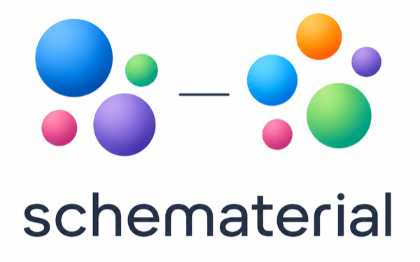

# schematerial



Schematerial translates between heterogeneous materials-science data models by generating semantic crosswalks, executable mappings, and human-in-the-loop alignment reports. 

AI agents assist with schema inspection, ontology grounding, ambiguity detection, and evidence-based mapping suggestions.

## Local development

**Prerequisites:** [uv](https://docs.astral.sh/uv/) and Python >=3.12.

```sh
uv sync                  # install deps + editable package into .venv
uv run pytest            # run tests
uv run ruff check .      # lint
uv run pyright           # type check
```