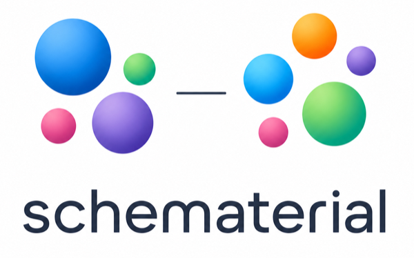

Schematerial translates between heterogeneous materials-science data models by generating semantic crosswalks, executable mappings, and human-in-the-loop alignment reports. 

AI agents assist with schema inspection, ontology grounding, ambiguity detection, and evidence-based mapping suggestions.

## Install

You need [uv](https://docs.astral.sh/uv/) and Python 3.12 or 3.13. The interface also needs [Node.js](https://nodejs.org/) 22 or newer.

```sh
git clone https://github.com/EBB2675/schematerial.git
cd schematerial
uv sync
```

## Run it

Three steps: build the interface, pull a schema out of a source package, then serve it.

**1. Build the interface.** Once, and again whenever `web/` changes.

```sh
cd web && npm install && npm run build && cd ..
```

**2. Get a schema to look at.** Source packages like NOMAD and BAM masterdata are never installed next to the app, so each one gets its own environment:

```sh
uv sync --project environments/bam --locked --python 3.12
uv sync --project environments/nomad --locked --python 3.12
```

The NOMAD one pulls in `nomad-lab` and is a large download. Now run the extractor with that environment's Python and keep the JSON it prints:

```sh
mkdir -p runs/extraction

environments/bam/.venv/bin/python src/schematerial/extractors/bam.py \
  --module bam_masterdata.datamodel.object_types \
  > runs/extraction/bam-object_types.json

environments/nomad/.venv/bin/python src/schematerial/extractors/nomad.py \
  --module nomad_simulations.schema_packages.general \
  > runs/extraction/nomad-general.json
```

Other modules work too, for example `bam_masterdata.datamodel.dataset_types` or `nomad_simulations.schema_packages.model_method`.

**3. Serve them.**

```sh
uv run schematerial-web \
  runs/extraction/bam-object_types.json \
  runs/extraction/nomad-general.json
```

Open <http://127.0.0.1:8000>. Give it a few seconds on startup while it reads both files. Use `--port` for a different port.

The page opens with one schema on each side, searchable together. The two panes are the workspace: **Align** browses them side by side, and **Mappings** is the crosswalk written so far. Either side reads as a list of elements or as a graph of its classes. Selecting an element on each side offers **Create mapping**, which opens the authoring drawer with an explicit subject, predicate and object; **Add semantic anchor** opens the bundled PMDco taxonomy so either element can be anchored to a term. Counts, diagnostics, keyboard help and toolchain versions are behind the `details` and `?` controls rather than on screen while you read.

See [schema aligner](docs/schema-preview.md) for what it shows, how the two sides are synchronised, the API it reads, and how to run its own checks.

## Local development

```sh
uv run pytest            # run tests
uv run ruff check .      # lint
uv run pyright           # type check
uv run schematerial-schema --check   # generated models match the schema
```

## Architecture

- [Source extraction contract](docs/extraction-contract.md)
- [NOMAD extraction](docs/nomad-extraction.md)
- [NOMAD JSON adapter](docs/nomad-adapter.md)
- [BAM masterdata extraction](docs/bam-extraction.md)
- [BAM masterdata JSON adapter](docs/bam-adapter.md)
- [Schema aligner](docs/schema-preview.md)

- [Materialisation cache](docs/materialisation-cache.md)
- [Annotations, ontology terms, and semantic types](docs/decisions/002-annotations-ontology-terms-and-semantic-types.md)
- [Web layer decisions](docs/decisions/004-web-layer.md)
- [Structural graph view decisions](docs/decisions/006-structural-graph-view.md)
- [BAM masterdata conversion decisions](docs/decisions/005-bam-masterdata-linkml-conversion.md)
